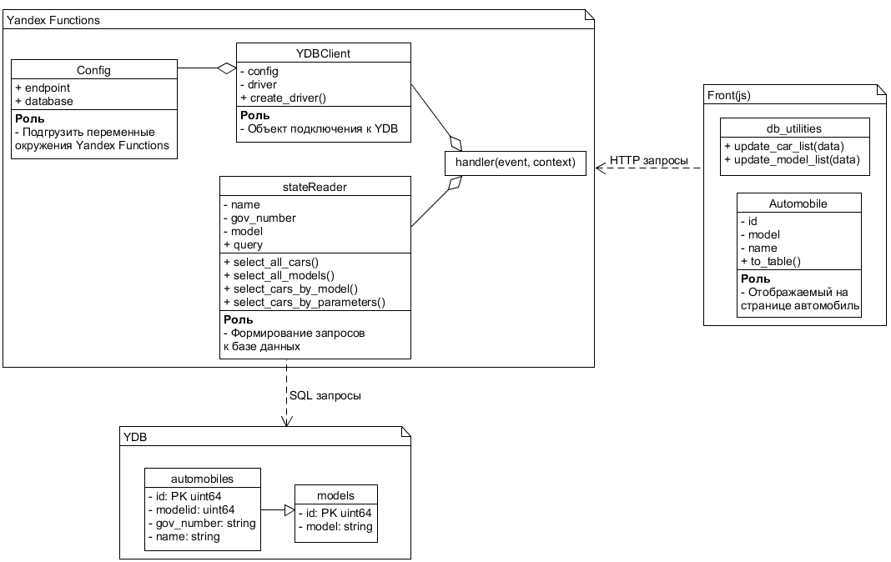

# Логистический интерфейс базы данных
Минималистичный проект с использованием 
- html/jQuery
- Yandex Functions
- Yandex Data Base

При загрущке страницы подргужается список автомобилей, по комбобоксу можно
их сортировать.

## Архитектура

Архитектура проекта приведена на схеме ниже. Также её можно посмотреть в файле `resources/architecture.uxf`
